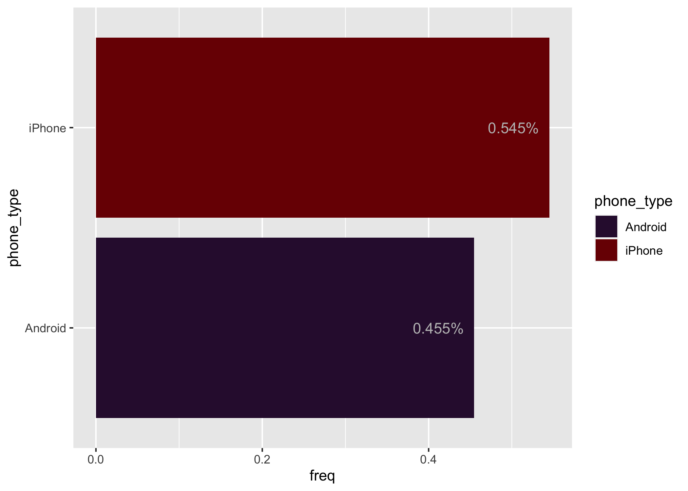
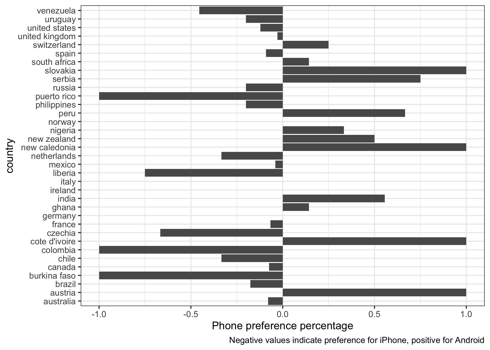

<!-- README.md is generated from README.Rmd. Please edit that file -->

# phonewar

<!-- badges: start -->
<!-- badges: end -->

`phonewar` provides a dataset containing peoples iPhone vs Android
preferences based on a survey done by tech magazine ‘The Hustle’
(<https://thehustle.co/home/>).

## Installation

You can install the phonewar from Github with:

``` r
remotes::install_github("condwanaland/phonedata")
```

## Example

To use `phonewar` first load it

``` r
library(phonewar)
## basic example code
```

`phonedata` contains a single dataframe you can load. It contains
information about the respondents phone preferences, their reasons for
this preference, the city they come from, and metadata about this city
(coordinates, population).

``` r
phones <- phonedata
head(phones)
#>   key phone_type
#> 1   1    Android
#> 2   2     iPhone
#> 3   3     iPhone
#> 4   4    Android
#> 5   5     iPhone
#> 6   6     iPhone
#>                                                                                                                                                                                                                                                 reason
#> 1                                                                                                                                                                                                                                                 Cost
#> 2                                                                                                                                                                            Ecosystem work base and connectivity between devices around work networks
#> 3                                                                                                               Ease of use, speed, app coverage, traditionally used iphone, tried to switch but it was harder to use & slow so I moved back to iphone
#> 4 I started with an iPhone. The battery lasted about 2 hours and Apple didn't seem to care. Also, it stopped working in cold weather. That's a problem in Canada. All in all, I find Apple products to be overpriced, confusing and they break easily.
#> 5                                                                                                                                                                                             Too many reasons to enumerate, but basically safety & UX
#> 6                                                                                                                                                                      Ease of use, connected ecosystem across various devices, privacy considerations
#>   considered_switching less_respect_for_other  original_city       city     lat
#> 1                   No                     No        spokane    spokane 47.6671
#> 2                  Yes                     No marbella spain   marbella 36.5167
#> 3                  Yes                     No           cork       cork 51.9000
#> 4                   No                     No         ottawa     ottawa 45.4247
#> 5                   No                     No manchester, uk manchester 53.4794
#> 6                   No                     No        bangkok    bangkok 13.7500
#>         lng        country population
#> 1 -117.4330  united states     412275
#> 2   -4.8833          spain     147633
#> 3   -8.4731        ireland     208669
#> 4  -75.6950         canada     989567
#> 5   -2.2453 united kingdom    2705000
#> 6  100.5167       thailand   17066000
```

You can check out some graphs of this data

``` r
library(dplyr)
library(ggplot2)
library(viridis)
library(tidyr)
phone_sum <- phonedata %>% 
  group_by(phone_type) %>% 
  summarise(n = n()) %>% 
  mutate(freq = n/sum(n))
ggplot(phone_sum, aes(y = phone_type, x = freq, fill = phone_type)) +
  geom_col() +
  geom_text(aes(label = paste0(round(freq, 3), "%"), hjust = 1.2), color = "grey") +
  scale_fill_viridis(discrete = TRUE, option = "turbo")
```



``` r
countries <- phonedata %>% 
  group_by(country, phone_type) %>% 
  summarise(n = n()) %>% 
  mutate(freq = n/sum(n)) %>% 
  filter(n > 1) %>% 
  filter(!is.na(country)) %>% 
  select(-n) %>% 
  pivot_wider(names_from = phone_type, values_from = freq, values_fill = 0) %>% 
  mutate(diff = Android - iPhone)

ggplot(countries, aes(y = country, x = diff)) +
  geom_col() +
  labs(caption = "Negative values indicate preference for iPhone, positive for Android",
       x = "Phone preference percentage") +
  theme_bw()
```



## License

The original collectors of this data was ‘The Hustle’
(<https://thehustle.co/home/>). The original version of the data can be
found here
(<https://docs.google.com/spreadsheets/d/1UC2I7vO-bS4Qcv0neNRDqJU2qt1Q6ednz8232cmb0_g/edit#gid=430244235>).
